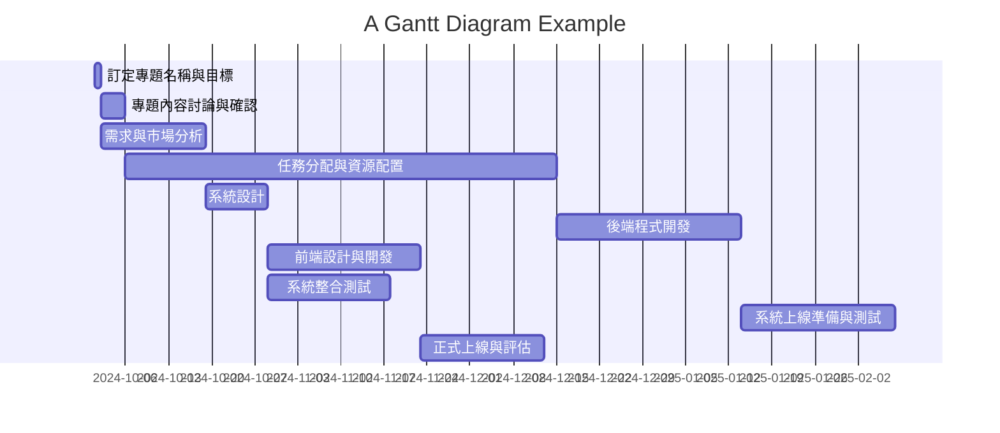
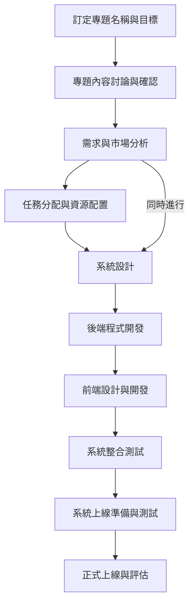

# AI分析消費者使用資訊並與商城結合
組長 侯勝傑 C111118126

組員 溫琦竣 C111118127

組員 劉瓊穗 C111118116

專題內容概要：本專題將深入探討AI如何分析消費者行為與偏好，並將這些資訊與線上商城整合，提升購物體驗。透過數據挖掘和機器學習技術，商城可實現精準行銷，提供個性化推薦，最終達到提高轉換率和顧客滿意度的目的。
## 工作分配
### 侯勝傑
>資料收集與設備操作
### 溫琦竣
>資料收集與設備操作
### 劉瓊穗
>資料收集與設備操作

任務	說明	需時(天)	前置任務
1	訂定專題名稱與目標	5	-
2	專題內容討論與確認	5	1
3	需求與市場分析	7	2
4	任務分配與資源配置	5	3
5	系統設計	7	4
6	後端程式開發	14	3,4
7	前端設計與開發	14	3,4
8	系統整合測試	14	6,7
9	系統上線準備與測試	7	8
10	正式上線與評估	4	9




```mermaid
gantt
    title 專案進度甘特圖
    dateFormat  YYYY-MM-DD

    section 規劃階段
    訂定專題名稱與目標        :done,   des1, 2024-10-03,2024-10-08
    專題內容討論與確認        :done,   des2, 2024-10-08, 2024-10-13

    section 分析與設計階段
    需求與市場分析           :active, des3, 2024-10-13, 2024-10-20
    任務分配與資源配置        :        des4, 2024-10-20, 2024-10-25
    系統設計                :        des5, 2024-10-25, 2024-11-01

    section 開發階段
    後端程式開發             :        des6, 2024-11-01, 2024-11-15
    前端設計與開發           :        des7, 2024-11-15, 2024-11-29

    section 測試與上線階段
    系統整合測試            :        des8, 2024-11-29, 2024-12-13
    系統上線準備與測試        :        des9, 2024-12-13, 2024-12-20
    正式上線與評估           :        des10, 2024-12-20, 2024-12-24

