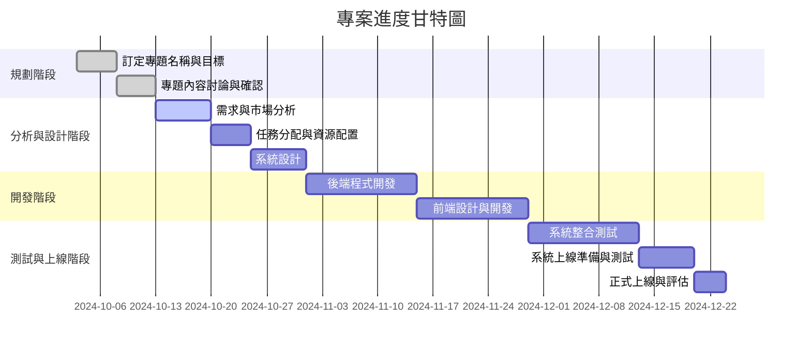

# AI分析消費者使用資訊並與商城結合
組長 侯勝傑 C111118126

組員 溫琦竣 C111118127

組員 劉瓊穗 C111118116

專題內容概要：本專題將深入探討AI如何分析消費者行為與偏好，並將這些資訊與線上商城整合，提升購物體驗。透過數據挖掘和機器學習技術，商城可實現精準行銷，提供個性化推薦，最終達到提高轉換率和顧客滿意度的目的。
## 工作分配
### 侯勝傑
>資料收集與設備操作
### 溫琦竣
>資料收集與設備操作
### 劉瓊穗
>資料收集與設備操作

[]
