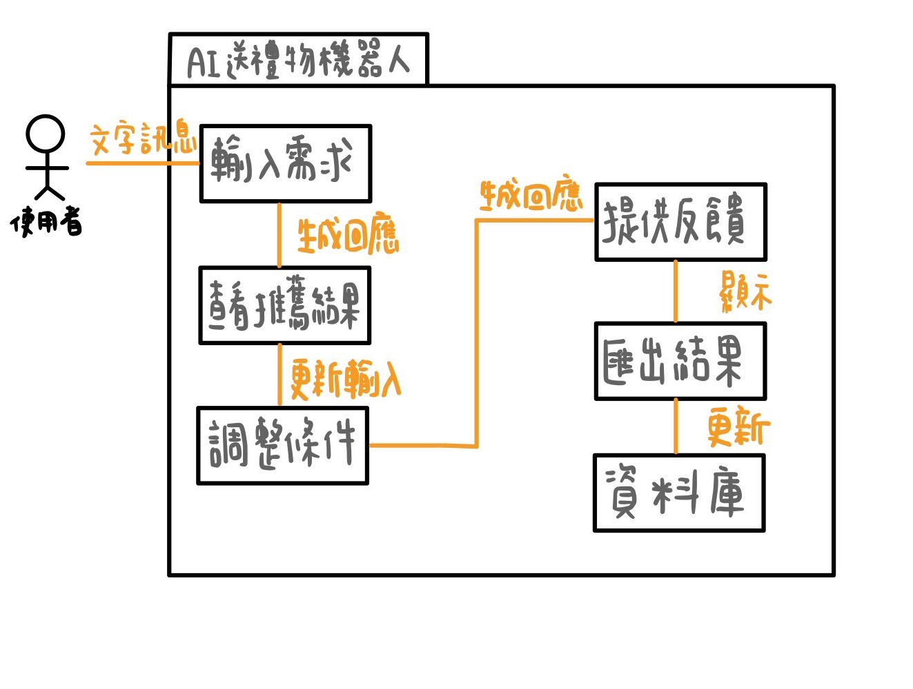

# 運用AI協助使用者送禮
組長 侯勝傑 C111118126

組員 溫琦竣 C111118127

組員 劉瓊穗 C111118116

專題內容概要：本專題將深入探討AI如何分析消費者行為與偏好，並將這些資訊與線上商城整合，提升購物體驗。透過數據挖掘和機器學習技術，商城可實現精準行銷，提供個性化推薦，最終達到提高轉換率和顧客滿意度的目的。
## 工作分配
### 侯勝傑
>資料收集與設備操作
### 溫琦竣
>資料收集與設備操作
### 劉瓊穗
>資料收集與設備操作

graphviz
digraph {
 node[shape=record];
 rankdir="LR";
    no1 [label = "訂定專題名稱與目標 | 任務:1 | 開始:第1天 | 結束:第5天 | 需時:5天"]
    no2 [label = "專題內容討論與確認 | 任務:2 | 開始:第6天 | 結束:第10天 | 需時:5天"]
    no1->no2
    no3 [label = "需求與市場分析 | 任務:3 | 開始:第11天 | 結束:第17天 | 需時:7天"]
    no2->no3
    no4 [label = "任務分配與資源配置 | 任務:4 | 開始:第18天 | 結束:第22天 | 需時:5天"]
    no3->no4
    no5 [label = "系統設計 | 任務:5 | 開始:第23天 | 結束:第29天 | 需時:7天"]
    no4->no5
    no6 [label = "後端程式開發 | 任務:6 | 開始:第30天 | 結束:第43天 | 需時:14天"]
    no3->no6
    no4->no6
    no7 [label = "前端設計與開發 | 任務:7 | 開始:第44天 | 結束:第57天 | 需時:14天"]
    no3->no7
    no4->no7
    no8 [label = "系統整合測試 | 任務:8 | 開始:第58天 | 結束:第71天 | 需時:14天"]
    no6->no8
    no7->no8
    no9 [label = "系統上線準備與測試 | 任務:9 | 開始:第72天 | 結束:第78天 | 需時:7天"]
    no8->no9
    no10 [label = "正式上線與評估 | 任務:10 | 開始:第79天 | 結束:第82天 | 需時:4天"]
    no9->no10
}

}

---

## 使用案例 1：輸入需求  
**描述**：  
使用者輸入對象資訊與需求條件（如預算和興趣），以產生推薦結果。

**流程**：  
1. 使用者啟動聊天機器人，選擇「開始推薦」。
2. 輸入對象性別（如「男性」）。
3. 提供預算範圍（如「500 - 1000 TWD」）。
4. 選擇興趣（如「籃球」）。
5. 系統根據條件生成推薦禮品清單。

**例外情況**：  
若條件不完整，系統將提醒使用者補充資訊。

---

## 使用案例 2：查看推薦結果  
**描述**：  
系統生成的推薦禮品結果展示給使用者進行查看。

**流程**：  
1. 系統展示推薦結果的列表，每個選項包含圖片、描述與價格。
2. 使用者點擊查看禮品的詳細資訊。
3. 使用者選擇是否滿意結果，若不滿意可調整需求。

**例外情況**：  
若無符合條件的推薦，系統提供類似商品或建議調整條件。

---

## 使用案例 3：提供反饋  
**描述**：  
使用者根據推薦結果提供正面或負面的反饋，以幫助系統優化未來的建議。

**流程**：  
1. 使用者選擇「滿意」或「不滿意」推薦結果。
2. 若不滿意，系統提供替代建議。
3. 系統記錄反饋，優化未來推薦。

**例外情況**：  
若替代建議仍不符合，系統可選擇導向人工客服。

---

## 使用案例 4：匯出推薦結果  
**描述**：  
使用者可以將推薦結果匯出為 PDF 或分享給其他人。

**流程**：  
1. 使用者點擊「匯出結果」按鈕。
2. 系統產生包含推薦商品的 PDF。
3. 使用者可選擇下載或透過連結分享結果。

---

